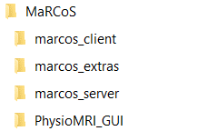
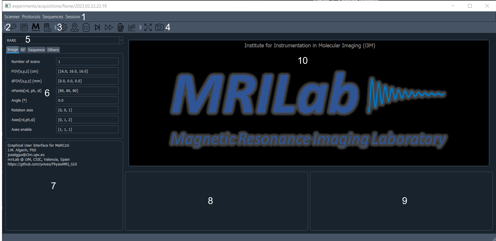

[](https://github.com/vnegnev/marcos_client)
[](https://github.com/vnegnev/marcos_server)
[](https://github.com/vnegnev/marcos_extras)

# MaRGE (MaRCoS Graphical Environment)

This repository contains the Python code for the MaRCoS Graphical Environment (MaRGE), a system for magnetic resonance imaging research. The GUI provides a user-friendly interface to interact with the MaRCoS system.

## Issues related to the IP of the MaRCoS client and MaRCoS server.
In order to provide an efficient communication between the client (your PC) and the server (the Red Pitaya) while using MaRGE, the IP of both must be properly configured. I found easier to set the IPs as static in both the client and the server, so here I will explain how to do it.

**Setup MaRCoS server with a static IP**

Once Yocto is installed in your SD card (see Section 1.2 on [marcos_wiki](https://github.com/vnegnev/marcos_extras/wiki/guide_setting_marcos_up)), get access to the SD card by introducing the SD card into the SD card slot of your computer. Then modify the file /etc/network/interfaces. Search for the `# wired or wireless interfaces` and replace the content by:
```Python
# Wired or wireless interfaces
autho eth0
iface eth0 inet static
   address 192.168.1.101
   netmask 255.255.255.0
   gateway 192.168.1.1
```
   NOTE: eth0 should be the name of your ethernet interface. You can check the name by using `ifconfig`

**Setup MaRCoS client with a static IP (Ubuntu)**

In new Ubuntu distros, this can be done by typing:`sudo nano /etc/netplan/01-network-manager-all.yaml`. Then write in the file:
```Python
network:
  version: 2
  renderer: NetworkManager
  ethernets:
    dhcp4: no
    addresses:[192.168.1.100/24]
    gateway4: 192.168.1.1
    nameservers:
      addresses: [8.8.8.8,8.8.4.4]
```
Save and exit, then type in the terminal `sudo netplan try` and press enter when waiting. If you restart the computer and type `ifconfig`, you should see the IP 192.168.1.100 on your etherent interface.

Right now, if you introduce your SD card into the Red Pitaya and connect the Red Piataya to the computer through Ethernet, you should be abble to access to the red pitaya by `ssh root@192.168.1.101`

**Setup MaRCoS client with a static IP (Windows)**

To setup the IP as static using Windows as the client, you have to modify your ethernet proerties as indicated in the figure


## Installation

To run MaRGE, you will need to have Python 3 installed on your computer. If you don't have it installed, you can download it from [python.org](https://www.python.org/downloads/).

Next, follow these steps to set up MaRGE:

1. Clone the following repositories into the same folder on your computer:

   - [marcos_client](https://github.com/vnegnev/marcos_client)
   - [marcos_server](https://github.com/vnegnev/marcos_server)
   - [marcos_extras](https://github.com/vnegnev/marcos_extras)
   - [MaRGE](https://github.com/mriLab-i3M/MaRGE)

Your folder structure should resemble the following:




**Figure 1: Example of folder structure**

2. Modify the following configuration files as needed:

- `local_config.py` in the `marcos_client` folder: This file contains information about the version of the Red Pitaya, its IP address, and the GPA board used in conjunction with the Red Pitaya.
- `hw_config.py` in the `MaRGE/configs` folder: This file contains information about the scanner hardware.
- `sys_config.py` in the `MaRGE/configs` folder: This file contains settings for displaying the session windows in the GUI.

**NOTE 1**: These files may not initially exist in the cloned repositories, but you can find copies of them in its corresponding folder.

**NOTE 2**: currently, MaRGE requires a Red Pitaya configured with a fixed IP. Dinamic IP address will be included in near future.

3. Set up bash: to do communication with server from the GUI, you need to set up the bash_path variable in the hw_config.py file.
   1. If running under Windows OS, you will need to install git_bash, and then set `bash_path = "directory/git_bash.exe"` in hw_config.py.
   2. If running under Ubuntu OS, set `bash_path = "gnome-terminal"` 

4. Install all the required modules to run MaRGE, listed in the `requirements.txt` file.

5. After making the necessary modifications to the configuration files, you can run the `main.py` file to launch MaRGE.

That's it! You should now have MaRGE up and running on your computer. Enjoy using it for your MRI research.

If you encounter any issues or have questions, please refer to the documentation or feel free to open an issue on the respective GitHub repositories for assistance.


## Issues

I found some issues when runing under linux. Here are some of them

**1. ERROR**

Error: qt.qpa.plugin: Could not load the Qt platform plugin "xcb" in "" even though it was found.
This application failed to start because no Qt platform plugin could be initialized. Reinstalling the application may fix this problem.

Available platform plugins are: eglfs, linuxfb, minimal, minimalegl, offscreen, vnc, xcb.

**SOLUTION**

Install `libxcb-xinerama0` with `sudo apt install libxcb-xinerama0`.

**2. WARNING**

Warning: Ignoring XDG_SESSION_TYPE=wayland on Gnome. Use QT_QPA_PLATFORM=wayland to run on Wayland anyway

**SOLUTION**

Disabled Wayland by uncommenting `WaylandEnable=false` in the `/etc/gdm3/custom.conf`

Add `QT_QPA_PLATFORM=xcb` in `/etc/environment`

## Description of the GUI

### Session Window

When you execute `main.py`, the session window is displayed on the screen.


**Figure 2: Session Window**

The session window serves as an input interface for important information such as the patient's name and weight. It also automatically generates an ID number. Currently, this ID number is generated based on the date and time, but users have the flexibility to modify it as needed. Some information can only be selected from predefined options, which are determined by the settings in the `sys_config.py` file.

Once you've filled in the necessary information, simply click the `Launch GUI` button to initiate the main window. At this point, a new folder is created in `experiments/acquisitions` based on the Project and Subject ID you specified.
Images and raw data will be saved in this folder.

### Main Window

The main window becomes accessible after clicking the `Launch GUI` button in the session window. This is where most of the essential tasks are performed, including system calibration, configuration of sequence parameters, visualization of results, and more.



**Figure 3: Main Window**

The main window is comprised of various components:

1. **Menubar:** This section offers different options related to setting up the Red Pitaya, configuring sequences, and other functionalities.

2. **MaRCoS Toolbar:** Here, you'll find tools specific to the MaRCoS system.

3. **Sequence Toolbar:** This toolbar is dedicated to sequence-related settings.

4. **Image Toolbar:** It provides options for image-related operations.

5. **Protocol Toolbar:** This toolbar allows you to manage protocols.

6. **Sequence Area:** This area enables custom modification of protocols or the execution of predefined parameters through the Protocoles tab.

7. **Console:** The console provides real-time feedback and information about ongoing processes.

8. **History List Table:** This table keeps a record of historical data.

9. **Info Table:** It displays essential information.

10. **Image Area:** This section is reserved for visualizing images and results.

Next, we'll explain how to use the GUI effectively, focusing on the most relevant controls and features.

### Toolbars

#### MaRCoS Toolbar (2)

Before executing any sequence, the user must establish a connection between the GUI and the Red Pitaya. This connection can be initiated through the MaRCoS toolbar (2) or via the scanner menubar. The MaRCoS toolbar consists of four distinct action buttons, from left to right:

- `Setup MaRCoS`: This button executes a sequence of actions in the following order: MaRCoS initialization, starting the MaRCoS server, and initializing the GPA board.

- `MaRCoS init`: This action updates the Red Pitaya with the latest version of the MaRCoS software.

- `MaRCoS server`: Use this button to connect to or disconnect from the MaRCoS server.

- `Init GPA`: Clicking this button triggers a code execution to initialize the GPA board. 
It's important to note that the GUI must be connected to the server before initializing the GPA board.
In case an interlock (under development) is connected to GPA and RFPA from Barthel, it also enables the power modules
remotely.

Upon executing `MaRCoS server` button remains pressed, and the sequence buttons become enabled. It's worth mentioning that this state remains even if the connection to the server fails (under development).
However, if connection is done, a terminal will show the information shown in Figure 4.


**Figure 4: MaRCoS server connection information**

#### Sequence Toolbar (3)

The Sequence toolbar is at the heart of the GUI, allowing users to run sequences efficiently. Sequence execution can be initiated through the Sequence toolbar (3) or the Sequence menubar. From left to right, the Sequence toolbar offers the following options:

- `Autocalibration`: This button automatically runs a series of sequences and uses the results to calibrate the system. The calibration process includes Larmor calibration, RF coil impedance matching, noise measurement, Rabi flops, and shimming.

- `Localizer`: Use this button to execute a quick RARE sequence with low resolution, helping users select the field of view (FOV) for subsequent sequences.

- `Sequence to List`: Clicking this button adds the current sequence configuration to the waiting list. This feature allows you to continue working in the GUI while sequences are running.

- `Acquire`: This button directly runs the current sequence configuration. Note that when a new sequence is selected and the `Acquire` button is clicked, the GUI may appear frozen. Please be aware that this button is slated for deprecation in future versions.

- `Iterative Run`: Activate this mode for sequences that support it, such as Larmor or noise measurements. Sequences that acquire images do not support iterative mode, and this button will be automatically toggled after the sequence ends.

- `Bender Button`: This button places all the sequences contained in the selected protocol into the history list.

- `Plot Sequence`: It generates a visualization of the instructions that will be sent to the Red Pitaya.

- `Save Parameters`: Use this button to save the sequence parameters to a CSV file located at `experiments/parameterisations/SequenceNameInfo.year.month.day.hour.minutes.seconds.milliseconds.csv`.

- `Load Parameters`: Load input parameter files and update the sequence parameters to the current sequence.

- `Save for Calibration`: This button saves the sequence parameters in the `calibration` folder. If the sequence is intended for autocalibration, it will automatically load parameters from the `calibration` folder.

These options within the Sequence toolbar provide users with the flexibility and control needed to execute various sequences and manage their parameters effectively.

#### Figures Toolbar (4)

The Figures toolbar provides quick access to two essential functions:

- `Fullscreen`: Clicking this button expands the image area to full-screen mode for a more detailed view.

- `Screenshot`: Use this button to capture a snapshot of the GUI. The captured image is saved in the `screenshots` folder.

These functions enhance the user experience by allowing for better visualization and documentation of the GUI's interface.

#### Protocols Toolbar (5)

The Protocols toolbar facilitates the management of protocols within the GUI. It includes the following options:

- `Add Protocol`: Clicking this button creates a new protocol, enabling users to organize and categorize their sequences.

- `Remove Protocol`: Use this button to delete a protocol that is no longer needed.

- `Add Sequence`: Adding a custom sequence to the selected protocol is made easy with this button.

- `Remove Sequence`: Clicking this button removes a sequence from the currently selected protocol.

The Protocols toolbar streamlines the organization and customization of your workflow, making it easier to work with sequences and protocols.

#### GUI Menubar (1)

The GUI menubar is a centralized hub for accessing various functions and features of MaRGE. It is divided into several categories, each containing specific options:

1. **Scanner**
   - `Setup MaRCoS`: Executes MaRCoS initialization, starts the MaRCoS server, and initializes the GPA board in sequence.
   - `MaRCoS init`: Updates the Red Pitaya with the latest MaRCoS software version.
   - `MaRCoS server`: Allows you to connect or disconnect from the MaRCoS server.
   - `Init GPA board`: Initializes the GPA board. Note that this action requires prior connection to the server.

2. **Protocols**
   - `New protocol`: Creates a new protocol for organizing and categorizing sequences.
   - `Remove protocol`: Deletes an existing protocol.
   - `New sequence`: Adds a custom sequence to the selected protocol.
   - `Remove sequence`: Removes a sequence from the currently selected protocol.

3. **Sequences**
   - `Load parameters`: Loads input parameter files and updates the sequence parameters to match the current sequence.
   - `Save parameters`: Saves the sequence parameters to a designated CSV file.
   - `Save for calibration`: Saves the sequence parameters to the `calibration` folder, useful for autocalibration purposes.
   - `Sequence to list`: Adds the current sequence configuration to the waiting list, allowing you to continue working while sequences run.
   - `Acquire`: Directly executes the current sequence configuration. (Scheduled for deprecation in future versions)
   - `Bender`: Places all sequences contained in the selected protocol into the history list.
   - `Plot sequence`: Generates a visualization of the instructions that will be sent to the Red Pitaya.

4. **Session**
   - `New session`: Initiates a new session, providing a fresh start for inputting essential information (comming soon).

The GUI menubar serves as a user-friendly interface for navigating and accessing the various functionalities of MaRGE.


## Configure the System

### Autocalibration

The `Autocalibration` feature is a vital component of the GUI, as it runs a series of five sequences to provide essential information to the GUI for system calibration. These sequences include:

- `Larmor`
- `Autotuning`
- `Noise`
- `Rabi flops`
- `Shimming`

However, to ensure that `Autocalibration` functions correctly, specific configuration steps are required. These steps must be followed for each sequence utilized by `Autocalibration`:

1. Select one of the five mentioned sequences from the sequence list in the `Custom` tab.
2. Configure the desired input parameters for the selected sequence.
3. Save the configuration by clicking the `Save for Calibration` button in the Sequence toolbar (3).

The `Save for Calibration` button generates a .csv file in the `calibration` folder for each sequence. After completing these steps for all five sequences, there should be five .csv files available in the folder, enabling the proper execution of Autocalibration.

It's important to note that failing to configure these parameters will result in the GUI using the last-used parameters for each calibration sequence, which are saved in the `experiments\parameterization` folder. If this folder is empty (e.g., for first-time users), the GUI will employ default parameters defined in the API.
It is really recommended to configure the autocalibration sequences and avoid using default parameters.

### Localizer

The Localizer sequence is typically a fast sequence with low resolution, designed to provide information about the field of view (FOV). Similar to Autocalibration, the Localizer sequence also requires specific parameters to be configured before use. Follow these steps to create the necessary file for the Localizer sequence:

1. Select the `Localizer` sequence from the sequence list in the `Custom` tab.

2. Configure the Localizer sequence with the desired parameters, taking into account your FOV requirements.

3. In the `Others` tab, set the `Planes` inputs. This parameter is a list of three elements, each of which can be set to 0 or 1. Use 1 to indicate that you want to acquire the corresponding plane and 0 to indicate that you do not want to acquire it. For example, setting `Planes` to [1, 1, 0] means that only sagittal and coronal planes will be acquired when the Localizer button is clicked.

4. Save the Localizer sequence configuration by clicking the `Save for Calibration` button in the Sequence toolbar (3).

After saving the configuration, clicking the `Localizer` button will place one Localizer sequence into the history list for each selected plane in the `Others` tab. This allows you to efficiently acquire the required Localizer data for your specific FOV needs.


## Run a Custom Sequence

Running a custom sequence within the GUI involves several steps to ensure a smooth workflow and accurate data acquisition:

1. **Prerequisite: Autocalibration and Localizer**
   - Before running a custom sequence, it is essential to perform the `Autocalibration` and `Localizer` processes.

2. **Localizer Completion**
   - Upon completion of the Localizer sequence, a message will be displayed in the console (7), and the item in the waiting list will be updated with its full name.
   - To view the image, you can left double-click on the corresponding item in the waiting list or view multiple images through the right-click menu.
   - In the image widget, you can click the FOV button to display a square representing the FOV that will be used for the next image. You can adjust the size, position, and angle (under development) of the FOV using the mouse. The corresponding values in the sequence list will be automatically updated. It's recommended to modify the FOV using this method, as it updates the FOV for all sequences. Typing the FOV values directly in the text box of the sequence list will only affect the selected sequence.

3. **Sequence Selection and Modification**
   - After selecting the desired FOV, choose an image sequence (RARE, GRE, or PETRA) and modify its parameters as needed.

4. **Running the Sequence**
   - Run the sequence by clicking the `Acquire` button (please note that this will freeze the GUI until the sequence completes) or place the sequence in the waiting list using the `Sequence to List` button. It is recommended to use the `Sequence to List` button to add the sequence to the waiting list, allowing you to continue programming the next image while others are acquired.
   - When the sequence is finished, a message will appear in the console, indicating the completion of the sequence. You can then view the results in the image area.

The parameters of the sequences are categorized into four different fields:
1) ***RF***: Contains parameters related to the RF signal, such as pulse amplitude, frequency, or duration.
2) ***Image***: Includes parameters related to the image, like the field of view or matrix size.
3) ***Sequence***: Encompasses parameters related to contrast, such as echo time or repetition time.
4) ***Others***: This field is for including other relevant parameters, such as gradient rise time or dummy pulses.

Each time a sequence is run:
1) It automatically saves a file in ***experiments/parameterization/SequenceName_last_parameters.csv***.
   - When you initialize the GUI, it loads the parameters from files with ***last_parameters*** in the name to continue the session from where it left off.
2) It creates four files in ***experiments/acquisitions*** inside the session folder:
   1) A .mat raw data file with the name ***SequenceName.year.month.day.hour.minutes.seconds.milliseconds.mat***. This file contains inputs, outputs, and other useful variables.
   2) A .csv file with the input parameters, named ***SequenceNameInfo.year.month.day.hour.minutes.seconds.milliseconds.csv***. This .csv file is useful if you want to repeat a specific experiment by loading the parameters into the corresponding sequence using the ***Sequence/Load Parameters*** menu.
   3) A .dcm file in Dicom Standard 3.0 format.
   4) A ismrmrd file (comming soon).

These steps ensure a well-organized and efficient workflow when running custom sequences within MaRGE.


## Create a Protocol

MaRGE offers the flexibility to run previously defined protocols, which are collections of different sequences with predefined parameters. These protocols are displayed in the Sequence area (6) and provide a convenient way to streamline your experimental workflows. When you first launch the GUI, the Protocols tab will be empty.

To create a new protocol, follow these steps:

1. Click the `New Protocol` button. This action opens a dialog box where you can enter the name of the new protocol.

2. The protocols must be created in the ***protocols*** folder. Once created, the protocol will appear in the protocol list.

With the protocol created, you can start adding sequences to it:

1. Select a sequence from the sequence list in the `Custom` tab.

2. Customize the sequence parameters as desired for the protocol.

3. Switch to the `Protocol` tab and select the desired protocol.

4. Click the `Add Sequence` button.

5. In the dialog box that appears, enter the name of the sequence as you'd like it to be displayed in the `Protocol` tab.

After saving the sequence, it will appear within the specified protocol. To execute sequences from the protocol, simply double-click on the desired sequence to add it to the waiting list.

Sequences can be removed from protocols by right-clicking the sequence and selecting `Delete` or by clicking the `Delete Sequence` button. Similarly, protocols can be deleted by clicking the `Delete Protocol` button and selecting the protocol to delete from the dialog box.

This flexible protocol management system makes it easy to organize and execute sequences according to your experimental needs within MaRGE.


## Structure of Folders and Files in the GUI

The internal architecture of MaRGE is organized into distinct folders and files that define its functionality and user interface. Understanding this structure can be helpful for those interested in further customization or development.

### `ui` Folder

The `ui` folder contains scripts that define the main windows of the GUI. Currently, it includes the following scripts:

- **window_main.py**: This script defines a class that inherits from QMainWindow. It forms the foundation of the main GUI window, where most user interactions take place.

- **window_session.py**: Similar to `window_main.py`, this script also defines a class that inherits from QMainWindow. It is responsible for managing the session window, which allows users to input essential information before conducting experiments.

- **window_postprocessing.py** (under development): This script is intended to define a class for a post-processing window, which will likely offer tools for analyzing and visualizing data after experiments.

### `widgets` Folder

The `widgets` folder contains scripts that define individual widgets or components used within the GUI. These widgets are responsible for various specific functionalities and user interactions.

### `controller` Folder

Scripts in the `controller` folder play a crucial role in determining how the windows and widgets react to user interactions. They define the logic behind the GUI's behavior, ensuring that it responds appropriately to user input.

As the GUI evolves and additional features are developed, more scripts and files may be added to these folders, enhancing the functionality and usability of MaRCoS.

Understanding this folder and file structure can provide a foundation for those interested in extending or customizing MaRGE to suit their specific research needs.

### `seq` Folder

The `seq` folder is where you can access the different sequences that can be applied in the scanner. It contains not only the primary sequences but also a parent sequence named `mriBlankSeq.py`. Additionally, you'll find the `sequences.py` file in this folder, which serves as an import point for all the sequences that the GUI can utilize.

### `configs` Folder

Within the `configs` folder, you'll encounter two essential configuration files:

- **hw_config.py**: This file stores hardware-related information crucial for the GUI. Variables in this file depend on the specific scanner hardware, such as gradients, or other essential values. Upon downloading the GUI for the first time, the filename is typically named `hw_config.py.copy`. Be sure to modify the filename appropriately to match your hardware and rename it before running the GUI.

- **sys_config.py**: This file contains useful information utilized by the session window of the GUI.

- **autotuning.py**: This file contains the serial number of the arduino used to control the autotuning.

### `protocols` Folder

The `protocols` folder is where user-created protocols are stored. Protocols are collections of predefined sequences with preset parameters, allowing for streamlined experimental workflows.

### `experiments` Folder

The `experiments` folder serves as the repository for storing the results of experiments conducted within the GUI. Within this folder, you'll find two subfolders:

- **acquisitions**: Scanner acquisitions are stored here, with each day's data stored in a separate folder labeled with the date (YYYY.MM.DD). The outputs of the scanner include:
  - .mat files containing raw data.
  - .dcm files with images.
  - .csv files containing input parameters.

- **parameterization**: This folder contains important data, including:
  - Sequence last parameters in CSV format.
  - CSV files generated when you click the "Save the parameters of a sequence to a file" icon in the GUI main window.

### `resources` Folder

In the `resources` folder, you'll find various icons used in the main menu and other parts of the GUI, as well as the images used in this README.

This structured organization of folders and files ensures that MaRGE remains efficient and organized, allowing for effective experimentation and customization.

# Adding a New Sequence to the GUI

In this section, we'll guide you through the process of creating and adding a new sequence to MaRGE. By following these steps, you'll be able to run simple sequences within the GUI. We'll use the example of creating a noise measurement sequence as a starting point.

## Body of the Sequence

1. **Create a New Sequence File**: Start by creating a new Python file for your sequence. In this example, we'll create a `noise.py` file inside the `seq` folder.

2. **Import Required Modules**: In your sequence file, import the necessary modules. It's crucial to have access to the `experiment` class from the `marcos_client` repository. Additionally, ensure access to the `marcos_client` and `MaRGE` folders for execution in standalone mode. Also, import the `mriBlankSequence` class, which contains various methods commonly used in many sequences. New sequences should inherit from the mriBlankSequence class. We also include the `configs.hw_config` module to get access to hardware properties and `configs.hw.units` that will be used to set the units of input parameters.

```python
import os
import sys
#*****************************************************************************
# Get the directory of the current script
main_directory = os.path.dirname(os.path.realpath(__file__))
parent_directory = os.path.dirname(main_directory)
parent_directory = os.path.dirname(parent_directory)

# Define the subdirectories you want to add to sys.path
subdirs = ['MaRGE', 'marcos_client']

# Add the subdirectories to sys.path
for subdir in subdirs:
    full_path = os.path.join(parent_directory, subdir)
    sys.path.append(full_path)
#******************************************************************************
import controller.experiment_gui as ex
import numpy as np
import seq.mriBlankSeq as blankSeq  # Import the mriBlankSequence for any new sequence.
import configs.hw_config as hw
import configs.units as units

```

3. **Create the `Noise` Sequence Class**: In your sequence file (`noise.py` in this example), create the `Noise` class that will inherit from the `mriBlankSeq.MRIBLANKSEQ` class. To be properly used by the GUI, the `Noise` class should contain at least four methods:

    a) **`sequenceInfo`**: This method should provide any useful information about the sequence, such as a brief description or relevant details (it can be empty).

    b) **`sequenceTime`**: Implement the `sequenceTime` method, which should return the time required by the sequence in minutes (it can returns 0).

    c) **`sequenceRun`**: The `sequenceRun` method is responsible for inputting the instructions into the Red Pitaya. It includes a `plotSeq` keyword argument that should be set to `1` if you want to plot the sequence or `0` for running the experiment. Another keyword is `demo` that can be established to `True` or `False` in case user can run simulated signals.

    d) **`sequenceAnalysis`**: Lastly, the `sequenceAnalysis` method is used to analyze the data acquired during the experiment. It includes a `mode` keyword that I use to plot call `plotResults` method from `mriBlankSeq` in case this parameter is set to `'standalone'`, but it can be used at convenience.

Here's an example of what the `Noise` class structure might look like:

```python
class Noise(mriBlankSeq.MRIBLANKSEQ):
    def __init__(self):
        super(Noise, self).__init__()

    def sequenceInfo(self):
        # Provide sequence information here

    def sequenceTime(self):
        # Return the time required by the sequence in minutes

    def sequenceRun(self, plotSeq=0, demo=False):
        self.demo = demo
        
        # Create sequence instructions
        
        # Input instructions into the Red Pitaya
        
        # Use the plotSeq argument to control plotting versus running.
        
        # Use the demo argument to control if you want to simulate signals.

    def sequenceAnalysis(self, mode=None):
        self.mode = mode
        ...
        result1 = {}
        result2 = {}
        ...
        self.output = [result1, result2]
        
        return self.output
        
        
        # Implement data analysis logic here
```

## Adding Input Parameters to the Sequence

```python
def __init__(self):
    super(Noise, self).__init__()

    # Input the parameters
    self.addParameter(key='seqName', string='NoiseInfo', val='Noise')
    self.addParameter(key='larmorFreq', string='Central frequency (MHz)', val=3.00, field='RF', units=units.MHz)
    self.addParameter(key='nPoints', string='Number of points', val=2500, field='RF')
    self.addParameter(key='bw', string='Acquisition bandwidth (kHz)', val=50.0, field='RF', units=units.kHz)
    self.addParameter(key='rxChannel', string='Rx channel', val=0, field='RF')
```

In this section, we'll walk you through the process of adding input parameters to your sequence. This step is essential for configuring and customizing your sequence within MaRGE.

To add new input parameters, we'll utilize the `addParameter` method available in the `mriBlankSequence` class. This method should be executed in the constructor of your sequence class and has keyword arguments:

- **key**: A string to be used as a key in dictionaries.
- **string**: A string that will be displayed in the GUI, serving as a user-friendly label.
- **value**: A numerical value or a list of numbers that will be presented in the GUI.
- **field**: A string to classify the parameter into one of four categories: 'RF', 'IMG', 'SEQ', or 'OTH'. The parameter will be shown in a tab according to this field.
- **units**: kHz, ms or similar called from `units` module
- **tip**: A string with tips regarding the parameter that will be shown in the tooltip bar of the GUI.

`mriBlankSeq` has the method `sequenceAtributes` that creates attributes with names according to the `key` field and associates values according to the `value` field taking into account the `units`. This method is executed by the GUI when a new run starts.

In this example, the `Noise` sequence is configured with several input parameters, each associated with a key, a user-friendly label, a default value, and categorized under the 'RF' field. The 'seqName' parameter, however, doesn't include the field keyword, making it informational but not displayed as a user-configurable input.

By following this approach, you can seamlessly add and customize input parameters for your sequence, allowing users to tailor the sequence parameters to their specific needs within MaRGE.

## Defining the `sequenceInfo` Method

```python
def sequenceInfo(self):
    print("Be open-mind,\nDo open-source")
```

In your sequence, you have the option to include a `sequenceInfo` method that provides useful information about the sequence. While this method is not critical for the functionality of your sequence, it is recommended to have it in place because the GUI may request this information.

## Implementing the `sequenceTime` Method

```python
def sequenceTime(self):
    return 0  # Duration in minutes (modify as needed)
```

The `sequenceTime` method is responsible for returning the duration of the sequence in minutes. While this method is not critical for the sequence's functionality, it is recommended to have it in place because the GUI may request this information.

In this example, the `sequenceTime` method returns a default duration of 0 minutes. You should adjust the return value to reflect the actual duration of your sequence.

## Implementing the `sequenceRun` Method

```python
def sequenceRun(self, plotSeq=0, demo=False):
    self.demo = demo
    
    # 1) Update bandwidth by oversampling factor
    self.bw = self.bw * hw.oversamplingFactor # Hz
    samplingPeriod = 1 / self.bw # s
    
    # 2) Create the experiment object
    self.expt = ex.Experiment(
        lo_freq=self.larmorFreq * 1e-6,
        rx_t=samplingPeriod * 1e6,
        init_gpa=False,
        gpa_fhdo_offset_time=(1 / 0.2 / 3.1),
        print_infos=False
    )
    
    # 3) Get true sampling period from experiment object
    samplingPeriod = self.expt.get_rx_ts()[0] # us
    
    # 4) Update bandwidth and acquision time
    self.bw = 1 / samplingPeriod / hw.oversamplingFactor # MHz
    acqTime = self.nPoints / self.bw # us
    self.mapVals['acqTime'] = acqTime

    # 5) Create sequence instructions
    self.iniSequence(20, np.array((0, 0, 0)))
    self.rxGate(20, acqTime, rxChannel=rxChannel)
    self.endSequence(acqTime+40)
    
    # 6) Execute the sequence
    if not plotSeq:
        rxd, msgs = self.expt.run()
        data = rxd['rx%i'%rxChannel]*13.788
        data = sig.decimate(data, hw.oversamplingFactor, ftype='fir', zero_phase=True)
        self.mapVals['data'] = data
    self.expt.__del__()
```

The `sequenceRun` method plays a pivotal role in your sequence as it manages the input of instructions into the Red Pitaya and controls whether to run or plot the sequence. The value of the `plotSeq` parameter determines the behavior: `plotSeq = 0` is used to run the sequence, while `plotSeq = 1` is used to plot the sequence.

You may assume that values associated to keys created in the constructor are available as attributes.

Here's a step-by-step breakdown of how to implement the `sequenceRun` method:

1. **Get the True Bandwidth and Sampling Period**: To address an issue related to the CIC filter in the Red Pitaya, an oversampling factor is applied to the acquired data. This factor can be encapsulated in the hardware module.

2. **Initialize the Experiment Object**: Next, initialize the experiment object (`self.expt`) using the parameters you've defined. The experiment object must be defined within the self object so that it can be accessed by methods of the parent class `mriBlankSequence`.

3. **Obtain True Sampling Rate**: After defining the experiment, obtain the true sampling rate used by the experiment object using the `get_rx_ts()` method.

4. **Update Acquision Parameters**: Calculate the true bandwidth and acquisition time based on the true sampling rate to prevent data misregistration and ensure precise measurements.

5. **Create sequence instructions**: Now that we have the true values of the sampling period and sampling time, we create the instructions of the pulse sequence.
   1. **Initialization**:
      - To begin the sequence, we initialize the necessary arrays and parameters.
      - In this step, we ensure that all relevant variables are set to zero and that the Red Pitaya is ready for data acquisition.

   2. **Rx Gate Configuration**:
      - The next step involves configuring the Rx gate for data measurement.
      - We specify the duration of the Rx gate, which is determined by the acquisition time and the selected Rx channel.
   
   3. **Completing the Sequence**:
      - To finish the experiment, we perform cleanup tasks.
      - All arrays and variables are reset to their initial values, ensuring a clean slate for the next sequence or experiment.
      - The total duration of the sequence is adjusted to account for the Rx gate duration and additional time for safety.

6. **Execute the sequence**:
   1. **Conditional Execution**:
      - Before running the sequence, we determine whether it should be executed or just plotted.
      - The decision is made based on the value of the `plotSeq` keyword argument, where:
        - `plotSeq = 0`: The sequence will be executed to collect data.
        - `plotSeq = 1`: The sequence will be plotted without data acquisition.
      - This flexibility allows users to visualize the sequence before running it, which can be useful for verification and debugging.

   2. **Data Acquisition (if applicable)**:
      - If the sequence is set to run (i.e., `plotSeq = 0`), the Red Pitaya performs data acquisition as instructed.
      - Data collected during the Rx gate period is processed to yield meaningful experimental results.
      - The acquired data is decimated, filtered, and stored for subsequent analysis.

   3. **Cleanup**:
      - Once data acquisition is complete, the sequence is finalized.
      - Cleanup tasks ensure that the Red Pitaya and related resources are reset to their initial state.
      - This step is crucial for maintaining the integrity of subsequent experiments.

## Implementing `sequenceAnalysis` method

```Python
    def sequenceAnalysis(self, mode=None):
        # Set the mode attribute
        self.mode = mode

        # 1) Data retrieval
        acqTime = self.mapVals['acqTime']  # ms
        data = self.mapVals['data']

        # 2) Data processing
        tVector = np.linspace(0, acqTime, num=self.nPoints)  # Time vector in milliseconds (ms)
        spectrum = np.fft.ifftshift(np.fft.ifftn(np.fft.ifftshift(data)))  # Signal spectrum
        fVector = np.linspace(-self.bw / 2, self.bw / 2, num=self.nPoints) * 1e3  # Frequency vector in kilohertz (kHz)
        dataTime = [tVector, data]  # Time-domain data as a list [time vector, data]
        dataSpec = [fVector, spectrum]  # Frequency-domain data as a list [frequency vector, spectrum]
        
        # 3) Create result dictionaries
        # Plot signal versus time
        result1 = {'widget': 'curve',
                   'xData': dataTime[0],
                   'yData': [np.abs(dataTime[1]), np.real(dataTime[1]), np.imag(dataTime[1])],
                   'xLabel': 'Time (ms)',
                   'yLabel': 'Signal amplitude (mV)',
                   'title': 'Noise vs time',
                   'legend': ['abs', 'real', 'imag'],
                   'row': 0,
                   'col': 0}

        # Plot spectrum
        result2 = {'widget': 'curve',
                   'xData': dataSpec[0],
                   'yData': [np.abs(dataSpec[1])],
                   'xLabel': 'Frequency (kHz)',
                   'yLabel': 'Mag FFT (a.u.)',
                   'title': 'Noise spectrum',
                   'legend': [''],
                   'row': 1,
                   'col': 0}
        
        # 4) Define output
        self.output = [result1, result2]
        
        # 5) Save the rawData
        self.saveRawData()
        
        # In case of 'Standalone' execution, use the plotResults method from mriBlankSeq
        if self.mode == 'Standalone':
            self.plotResults()
        
        # 6) Return the self.output
        return self.output
```


The `sequenceAnalysis` method plays a crucial role in preparing data for display in the GUI or generating custom plots when the GUI is not utilized. This method performs a series of tasks to achieve this goal:

1. **Data Retrieval**: It retrieves previously acquired data stored in `self.mapVals`.

2. **Data processing**: Using the Inverse Fast Fourier Transform, it calculates the signal spectrum from the acquired data.

3. **Results**: Creates dictionaries that will be used in the GUI layout for user interaction and data display.

4. **Define Outputs**: `self.outputs` is a list of results that will be used by the `plotResults` method and by the GUI to generate the figure widget. It is convenient to save the list in `self.output` attribute. This attribute is used in the GUI to update the widgets if the user repeats the experiment.

5. **Save rawData**: Saves the raw data using the `self.saveRawData()` method.

6. **return**: the `sequenceAnalysis` method should return the `self.output` variable containing the list of dictionaries that provides the results.

## Execute the sequence in Standalone
```Python
if __name__=='__main__':
    seq = Noise()   # Creates the sequence object
    seq.sequenceAtributes()     # Creates attributes according to input parameters keys and values
    seq.sequenceRun(demo=False) # Execute the sequence
    seq.sequenceAnalysis(mode='Standalone') # Show results
```

# Additional notes

## CIC filter issues

It's crucial to be aware of a systematic delay that occurs as a result of the CIC filter applied to the acquired data in the Red Pitaya. This delay consists of 3 data points and should be taken into account when processing and analyzing acquired data.

The CIC filter's delay impacts the alignment of acquired data and can influence the timing of various sequence operations. This means that the timestamp associated with a data point may not reflect its true acquisition time accurately. Understanding and accommodating this delay is essential for accurate data processing and interpretation within MaRGE.

To mitigate potential issues related to the CIC filter's delay, it is also recommended to discard the first five to ten data points during data processing. This practice helps in stabilizing the data and removing any transient effects caused by the filter's delay. Additionally, consider adjusting timestamps or applying correction factors to accurately account for the delay when conducting precise time-sensitive analyses.

The `mriBlankSeq` module already includes methods for rx gating that account for these considerations, simplifying the implementation of sequences and ensuring reliable data acquisition and processing (not shown in this example).

## The `mapVals` Variable

The `mapVals` variable is a crucial element within the sequences of MaRGE. It serves as a dictionary inherited from the `mriBlankSeq` class, playing a vital role in managing and preserving information throughout the sequence execution. Below, we explore the significance and usage of the `mapVals` variable:

- **Initialization and Structure**:
  - The `mapVals` dictionary is initialized with predefined key-value pairs.
  - These keys act as unique identifiers for specific information, and their associated values can encompass numbers or lists of numbers.

- **Storage of Information**:
  - During the sequence's execution, you have the flexibility to store pertinent information within the `mapVals` dictionary. This information can encompass various aspects, including parameters, interim results, or any other data deemed essential.

- **Saving Data in Raw Data**:
  - Upon the sequence's completion, the `saveRawData` method is utilized to generate .mat and .dcm files containing all the data stored within the `mapVals` dictionary. This .mat file plays a pivotal role in preserving the experimental data and results.
  - **TODO**: save data in ISMRMD-format and NIFTI-format. Add XNAT.
- **Persistent Inputs**:
  - It is worth noting that, although the `mapVals` dictionary is cleared of most information after each sequence run, the inputs defined through the `addParameter` method remain intact. This ensures the retention of critical input parameters for reference and potential use in future experiments.

In summary, the `mapVals` variable functions as a dynamic storage space for various types of data within a sequence. It facilitates the management and organization of vital information throughout the sequence execution process. Additionally, it guarantees that essential input parameters are accessible for reference and subsequent experiments.

