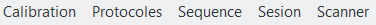
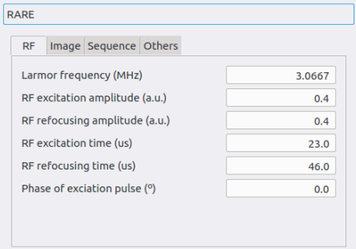
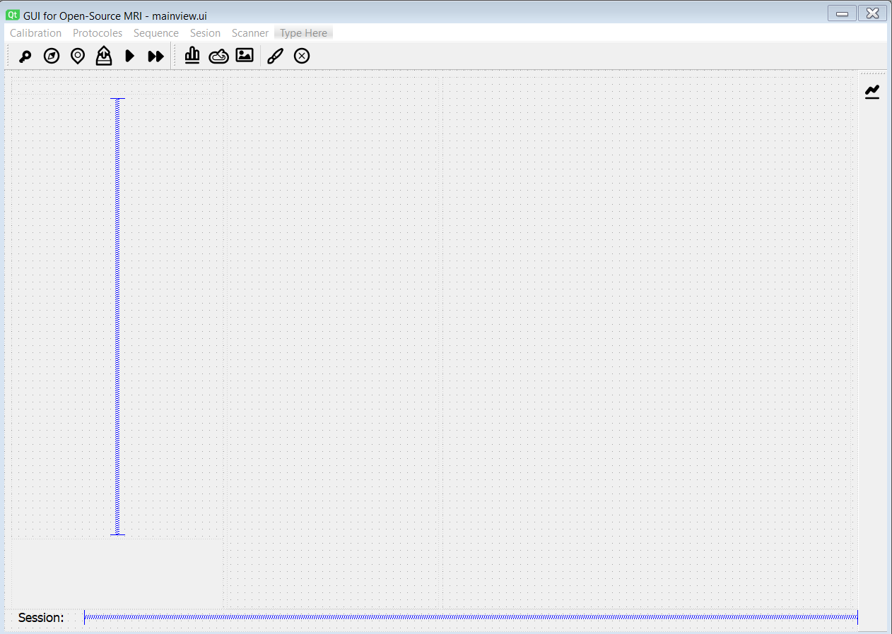

# PhysioMRI_GUI

Python code associated to the Graphical User Interface of PhysioMRI scanner from MRILab.

## Technical requirements to use PhysioMRI GUI 

1. Install python3.

2. Install pyQt5 and other python packages like datetime, nibabel, numpy,  .

3. Clone the following repositories from *https://github.com/vnegnev* at the same level of directories than PhysioMRI_GUI:

- marcos_client
- marcos_server
- marcos_extras

Edit the values of the variables in `local_config.py` inside marcos_client according to your IP address, Red Pitaya model and kind of gradient board available.

Execute the GUI by running ***FirstMRI.py***.

## How to use the GUI

### Start the connection with the Red Pitaya

When the GUI starts by executing ***FirstMRI.py***, the latest FPGA firmware and MaRCoS server are installed onto the Red Pitaya.
If the user is working under Windows os, a popup screen will show information about the server connection.
If the user is working under Linux os, information about server connection is usually shown on the python console.

If the initialization shows warnings related to the server connection proccess, make sure the .sh files in the PhysioMRI_GUI directory have permission to be executed as a program.
If the problems persist, try to install the latest version of FPGA firmware manually.
To do this, open a terminal and type:
```
../marcos_extras/copy_bitstream.sh "ip_of_your_red_pitaya" rp-122
ssh root@"ip_of_your_red_pitaya" "~/marcos_server"
```


### Launch FirstMRI.py

The first window to appear is the sessionWindow (Figure 1), where the user can first select the object that is going to be imaged and introduce parameters like the ID, demographic variables, etc.


**Figure 1.- Session Window**

Then, we launch the GUI main window by clicking to the corresponding icon. We distinguish 5 different areas in the GUI main window: 1) Main menu icons, 2) Sequence selection, 3) Parameters area, 4) Plotting area and 5) Console area. Figure 2.


**Figure 2.- Main Window**

### GUI main menu


1) Initialization of the GPA: makes the initialization of the GPA gradients card.
2) Calibration of the system: run a set of sequences that allows system calibration.
The calibration sequences that are executed include larmor calibration, b1 efficiency and noise.
Future releases will include shimming calibration.
3) Localizer: run a localizer sequence.
It is based on RARE sequence with three 2-dimensional projections, one for each direction x, y and z.
4) Activate upload to XNAT: if this button is enabled, the GUI uploads the MRI to the XNAT system if XNAT is installed.
5) Start acquisition: start the acquisition with the selected sequence and the parameters introduced.
6) Iterative run: If this button is enabled, the start acquisition button runs the selected calibration sequence indefinitely.
Sequence run stops once this button is disable.
This allows to interactively modify sequence parameters while the sequence is running. 
7) View the defined sequence: plot the sequence (RF pulses and X, Y and Z gradients). 
8) Batch acquisition: it allows acquiring multiple images with multiple sequences sequentially, without human intervention. 
9) Change session: it closes the `GUI main window` and it opens the `Session Window` again. 
10) Change Window appearance
11) Close window: it closes the GUI and the server connection.

### GUI menubar



The last version of the GUI also includes a menubar with different options.

1) `Calibration`: directly run calibration sequences with previously saved parameters.
   1) `Larmor`: it runs a quick spin echo and shows the time-domain and frequency-domain signal providing information about the Larmor frequency.
   2) `Noise`: it runs a single acquisition of noise and shows the time-domain noise and frequency-domain spectrum providing information about the rms noise.
   3) `Rabi flops`: it runs spin echoes while sweeping flip angles. It shows the amplitude evolution of the FID after the excitation pulse and the echo.
   4) `CPMG`: it runs CPMG to estimate T2 values. It fit the curve to different exponential evolutions.
   5) `Inversion Recovery`: it runs spin echo with inversion recovery to estimate T1 values.
   6) `Shimming`: it sweeps the shimming in the three axis to estimate the best value
   7) `Autocalibration`: it runs Larmor, Noise and Rabi flops sequentially.
2) `Protocoles`: directly run pre-defined image protocoles, e.g., RARE with specific contrasts. Right now, the options are:
   1) `Localizer`: it runs 3 RARE projections, one per main axis and show the resulting images into the localizer region.
   2) `RARE 3D T1`.
   3) `RARE 3D T2` (under development).
   4) `RARE 3D Rho` (under development).
3) `Sequence`: show different options related to sequences.
   1) `Load parameters`: it allows the user to load previously saved parameters.
   2) `Save parameters`: it saves the parameters to ***experiments/parameterisations/SequenceNameInfo.year.month.day.hour.minutes.seconds.milliseconds.csv"
   3) `Run sequence`: it runs the selected sequence.
   4) `Plot sequence`: it plot the selected sequence.
4) `Session`:
   1) `New session`: it closes the main GUI and open the session windows again.
5) `Scanner`:
   1) `Init GPA`: initialize the GPA.
   When doing this, GPA generates a high peak voltage, so it is recommended to turn off the gradient amplifier before clicking this button.
   2) `Init Red Pitaya`: install the last version of MaRCoS and connect to the server.
   This is equivalent to Copybitstream + Init marcos server buttons.
   3) `Copybitstream`: install the last version of MaRCoS into the Red Pitaya
   4) `Init marcos server`: connect to the server
   5) `Close marcos server`: close the server

I noted that in some cases under Ubuntu OS, the Init Red Pitaya does not work properly.
In that case, try with Copybitstream and Init marcos server individually.
Note that the Init Red Pitaya or Copybitstream is required only the first time that you run the GUI after plugging the Red Pitaya to the power.
### Running Localizer
(Under development)

### Running custom sequence.



It is possible to run customized sequences from the GUI.
Sequence parameters are customized from the sequence area in the main window of the GUI.
To do this, select the sequence that you would like tu run and, then, modify the parameters conveniently.
The parameters are classified in four different fields:
1) ***RF***: it includes parameters related to RF signal like pulse amplitude, frequency or duration.
2) ***Image***: it includes parameters related to the image like field of view or matrix size.
3) ***Sequence***: it includes parameters related to contrast like echo time or repetition time.
4) ***Others***: a field to include other interesting parameters like gradient rise time or dummy pulses.

When the parameters are properly modified, you can run the sequence by clicking ***Sequence/Run sequence*** or the corresponding run icon button.

Each time you run a sequence:
1) It automatically save a file in ***experiments/parameterisation/SequenceName_last_parameters.csv***.
When the user initialize the GUI, it automatically loads the parameters from the files with ***last_parameters*** in the name to continue the session from the last point.
This file is also used by the sequences in `Calibration` option.
So if you want to modify the quick calibration sequences, just run a custom calibration sequence first to save the parameters.
2) It creates two files in ***experiments/acquisitions*** inside a folder with the date of the experiment:
   1) a .mat raw data with name ***SequenceName.year.month.day.hour.minutes.secons.milliseconds.mat***.
   This file contains the inputs and outputs as well as any other useful variable.
   The values saved in the raw data are those contained inside the `mapVals` dictionary.
   2) a .csv file with the input parameters with name ***SequenceNameInfo.year.month.day.hour.minutes.secons.milliseconds.csv***
The .csv file is useful if you want to repeat a specific experiment by loading the parameters into the corresponding sequence with the ***Sequence/Load parameteres*** menu.

      
#### Calibration of the system

(under development)

#### Batch acquisition

It allows acquiring multiple images with different sequences sequentially, without human intervention (Figure 4). With the `plus` button you can add files with sequence parameters previously saved in the GUI main window. You can remove them with the `minus` button.


**Figure 4.- Batch acquisition window** 

## Structure of the folders and files in the GUI     

PhysioMRI_GUI folder contains many folders and files. You find here a description of their content.

### `ui` folder
		
It contains the files created with Designer Qt5, which are a basic structure of the different windows.
There are different kinds of ui files in the GUI.
On the one hand, we have the general structure of the four windows: session window, main window, calibration window (under development) and batch window (under development).
Session and batch uis are similar with each other (Figure 6).



**Figure 5.- Main ui**


**Figure 6.- Session and batch uis**

There are also ui files that represent single elements that will be introduced programally to the general structure of the windows (to one of the four previous windows).
Right now the gui uses only one sigle element:

- inputparameters.ui (Figure 7)


**Figure 7.- Input parameter ui**

### `controller` folder

In this folder you will find all the python functions that control:

1. The 4 GUI windows (*sessioncontroller.py, mainviewcontroller.py, calibrationcontroller.py (under development), batchcontroller.py*).
These files give functionality to the different icons in the menus, 
2. The interactive addition of input elements in these windows, i.e. according to the sequence selected in the sequence selector, many inputparameter.ui will be added to the mainwindow.ui.
These controllers are: *sequencecontroller.py* for the main window, *calibfunctionscontroller.py* (under development) for the calibration window and *sessionviewer_controller.py* for the session window. The batch window does not load input parameters automatically.

### `seq` folder

Folder that contains the different sequences that can be applied in the scanner.
In addition to the main sequences, it also contains the parent sequence `mriBlankSeq.py`.
Also in this folder we can find the `sequences.py` file, where we will import all the sequences that will be read by the GUI.

### `seq_standalone` folder

Folder that contains sequences that can be executed in the scanner independently of the GUI and are firstly stored here to be tested.
Last version of the GUI does not require of this folder.
Sequences in *`seq`* folder can be executed in the scanner with or without the GUI.
Then, in a future release of the GUI this folder will not be available.

### `manager` folder

- *datamanager.py*: class for managing the data processing of acquired data.

### `configs` folder

- *hw_config.py*: a file with variables used in all the sequences. 
These variables depend on the scanner hardware (i.e. gradients) or other general values.
When downloading the GUI by the first time, the file name is *hw_config.py.copy*.
The filename needs to be properly modified according to your hardware and renamed before to run the GUI.
- *globalFunctions.py*: script with multiple functions that can be used globally.

### `experiments` folder

The results of the experiments are stored in this file. There are three folders inside:

- *acquisitions*: the scanner acquisitions are stored here.
A folder per day is created, with the date as name (YYYY.MM.DD).
The output of the scanner is stored inside, which is:
  - .mat file with raw data.
  - .nii file with image.
  - .csv file with input parameters.
- *parameterization*: folder that contains:
  - the sequence last parameters in csv format
  - csv file generated when you click the *Save the parameters of a sequence to a file* icon in the GUI main window.
- *protocols*: folder that contains the parameter files (in csv format) to be used as protocols.

### `resources` folder

In this folder, the icons used in the main menu (and others) are stored.

### `images` folder

The images used in this readme are stored here.

### `view` folder

Some stylesheets are stored in this folder, which allow changing the appearance of the GUI with the button in the GUI main menu. These two styles are in use at the moment:
       
- breeze-light.qss
- breeze-dark.qss

### Other files 

- **Console function**: *stream.py* is a class used to write error messages in the console of the GUI.  

## How to add a new sequence to the GUI

In this section I will show how to create a new sequence.
To do this, I will go step by step until we can get a noise measurement.
At the end of this section, the user should be able to run simple sequences.

### Body of the sequence

We first start by creating a new *noise.py* file inside the *`seq`* folder (check the file to see the full code)
We need to import some different modules.
Importantly, to run the sequence wihtout the GUI we need to be able to import the experiment class that it is contained in the *`marcos_client`* repository.
Then we need to provide access to the folders:
````python
import os
import sys
#*****************************************************************************
# Add path to the working directory
path = os.path.realpath(__file__)
ii = 0
for char in path:
    if (char=='\\' or char=='/') and path[ii+1:ii+14]=='PhysioMRI_GUI':
        sys.path.append(path[0:ii+1]+'PhysioMRI_GUI')
        sys.path.append(path[0:ii+1]+'marcos_client')
    ii += 1
#******************************************************************************
import experiment as ex
````
You may note that I also include the *`PhysioMRI_GUI`* folder.
This is due to some issues that I found under Windows OS.
Under linux OS you can just include the *`marcos_client`* directory.

Next we need to import the *mriBlankSequence* class.
*mriBlankSequence* contains many useful methods that are common to many sequences such as create parameters, rf pulses, gradient pulses, readout or save/load data between others.
New sequences should inherit from the mriBlankSequence.

````Python
import seq.mriBlankSeq as mriBlankSeq  # Import the mriBlankSequence for any new sequence.
````

Then we can create our class *Noise* that will inherit from *mriBlankSeq*.
To be properly used by the GUI, the class must contain at least four methods:
1) *sequenceInfo* that contains any useful information about the sequence.
2) *sequenceTime* that returns the time required by the sequence in minutes.
3) *sequenceRun* that inputs the instructions into the Red Pitaya.
It includes a keyword argument *seqPlot* that should be 1 if user do not want to run the instructions contained in the red pitaya.
This is used in the GUI to plot the sequence instead of run the experiment.
4) *sequenceAnalysis* to analyse the data acquired in the experiment.
````Python
class Noise(mriBlankSeq.MRIBLANKSEQ):
    def __init__(self):
        super(Noise, self).__init__()

    def sequenceInfo(self):

    def sequenceTime(self):

    def sequenceRun(self, plotSeq=0):

    def sequenceAnalysis(self, obj=''):
````

### How to add input parameters to the sequence
To add new input parameters, the *mriBlankSequence* contains the method *addParameter* that needs to be run in the constructor of the class.
This method requires four keywords arguments: 
- *key*: a string to be used as key on the dictionaries
- *string*: a string to be shown in the GUI
- *value*: number or list of numbers to be shown in the GUI
- *field*: a string to classify the parameter into the boxes.
It can be 'RF', 'IMG', 'SEQ' or 'OTH'
```Python
def addParameter(self, key='', string='', val=0, field=''):
```
For the example of *Noise* sequence I will include the input parameters shown here:
````Python
    def __init__(self):
        super(Noise, self).__init__()
        # Input the parameters
        self.addParameter(key='seqName', string='NoiseInfo', val='Noise')
        self.addParameter(key='larmorFreq', string='Central frequency (MHz)', val=3.00, field='RF')
        self.addParameter(key='nPoints', string='Number of points', val=2500, field='RF')
        self.addParameter(key='bw', string='Acquision bandwidth (kHz)', val=50.0, field='RF')
        self.addParameter(key='rxChannel', string='Rx channel', val=0, field='RF')
````
Note that the first parameter does not include the keyword *field*.
In this way, seqName is not included into the input parameters field of the GUI, but it is still saved in the raw data as information.

### sequenceInfo
The *sequenceInfo* method contains useful information about the sequence.
This method is not critical, and you may leave it empty, but make sure that the method exist because the GUI will ask for it.
For this example I will just do:
```Python
    def sequenceInfo(self):
        print("If you want a better world \n do open source")
```

### sequenceTime
The *sequenceTime* method returns the time of the sequence in minutes.
As the *sequenceInfo* method, it is no critical, but the GUI will ask for it.
```Python
    def sequenceTime(self):
        return(0)
```

### sequenceRun
In this method we will input the instructions into the Red Pitaya and we will run the sequence depending on the *plotSeq* value.
According to the GUI, *plotSeq = 0* is used to run the sequence and *plotSeq = 1* is used to plot the sequence.
To create the instructions, we will make use of the methods already available into the parent *mriBlankSequence*.

First we will create a local copy of the input parameters into the *sequenceRun*
````Python
        # Create inputs parameters
        larmorFreq = self.mapVals['larmorFreq'] # MHz
        nPoints = self.mapVals['nPoints']
        bw = self.mapVals['bw']*1e-3 # MHz
        rxChannel = self.mapVals['rxChannel']
````
Note that time parameters are defined in microseconds, as demanded by the Red Pitaya.

Now we create the experiment object.
The experiment object needs to be defined into the *self* object to be used by the methods of the parent class *mriBlankSequence*.
````Python
         bw = bw * hw.oversamplingFactor
         samplingPeriod = 1 / bw
         self.expt = ex.Experiment(lo_freq=larmorFreq,
                                   rx_t=samplingPeriod,
                                   init_gpa=False,
                                   gpa_fhdo_offset_time=(1 / 0.2 / 3.1),
                                   print_infos=False)
         samplingPeriod = self.expt.get_rx_ts()[0]
         bw = 1/samplingPeriod/hw.oversamplingFactor
         acqTime = nPoints/bw
````
Note that:
- To fit an issue related to the CIC filter in the Red Pitaya, we apply an oversampling factor of six to the acquired data.
This factor is contained into the hardware module
````Python
import configs.hw_config as hw
````
Once the acquired data is obtained, we apply a decimation with a *fir* filter to recover the required acquisition bandwidth.
- One of the keyword arguments of the experiment is the sampling period *rx_t*.
The true sampling rate is not the same as the value that we input to the experiment class.
Once the experiment is defined, the user needs to get the true sampling rate with the method *get_rx_ts().
Then, the user must calculate the true bandwidth and acquisition time to avoid data miss registration.
- Future release will include a method that will do this automatically.

Now that we have the true values of the sampling period and sampling time, we input the instructions into the Red Pitaya.
````Python
         # SEQUENCE
         self.iniSequence(20, np.array((0, 0, 0)))
         self.rxGate(20, acqTime, rxChannel=rxChannel)
         self.endSequence(acqTime+40)
````
here we do:
- initialize the arrays to zero
- open the Rx gate to measure data
- finish the experiment by setting all the arrays to zero

At this point sequence instructions are already in the Red Pitaya.
Here is where we have to choose if the sequence is going to be run or not.
To do this, place the experiment *run* method in a conditional *if not plotSeq*.
In this way, we will run the sequence only if the keyword argument is *plotSeq = 0*:
````Python
         if not plotSeq:
             rxd, msgs = self.expt.run()
             data = rxd['rx%i'%rxChannel]*13.788
             data = sig.decimate(data, hw.oversamplingFactor, ftype='fir', zero_phase=True)
             self.mapVals['data'] = data
         self.expt.__del__()
````
If keyword argument *plotSeq = 0*, then the first is to run the experiment.
This is done by 
````Python
rxd, msgs = self.expt.run()
````
that provides two outputs:
- *rxd* that contains the data from the two different Rx channels in rxd['rx0'] and rxd['rx1']
- *msgs* that contains information provided by the server.

A correction that I use to employ is to multiply the signal by 13.788.
````Python
data = rxd['rx%i'%rxChannel]*13.788
````
This is to get the values in millivolts.

Finally, data must be decimated and filtered to obtain the results in the required acquisition bandwidth.
````Python
data = sig.decimate(data, hw.oversamplingFactor, ftype='fir', zero_phase=True)
````

Then, I save the data into the *mapVals* variable to save data into the rawData as .mat file:
````Python
self.mapVals['data'] = data
````

At this point the last remaining task is to delete the experiment object:
````Python
self.expt.__del__()
````

### The `mapVals` variable
`mapVals` is a key variable of the sequences.
It is a dictionary inherited from the `mriBlankSeq`.
The `addParameter` method creates the keys and values that are added to the dictionary.
The `saverRawData` method creates the .mat file with all information contained inside the `mapVals` dictionary.
Then, you have to save any information that you want into your rawdata in this variable.
Note that each time tha you run a sequence, the GUI clear all information in the mapVals except for the inputs.

### sequenceAnalysis
The *sequenceAnalysis* method is where we manipulate the data to be properly shown into the GUI or into our defined plot if we do not use the GUI.
Basically what this method need to do is
- Recover the acquired data previously saved in *self.mapVals['data']*
- Calculate the signal spectrum through the inverse fast fourier transform
- Save the rawData with *self.saveRawData()*
- Create the widget to be located into the GUI layout.

In our example, to recover the acquired data and other useful data:
````Python
acqTime = self.mapVals['acqTime'] # ms
nPoints = self.mapVals['nPoints']
bw = self.mapVals['bw'] # kHz
data = self.mapVals['data']
````

Then, we need to create the time and frequency arrays, and calculate the spectrum:
````Python
tVector = np.linspace(0, acqTime, num=nPoints) # ms
spectrum = np.fft.ifftshift(np.fft.ifftn(np.fft.ifftshift(data)))
fVector = np.linspace(-bw / 2, bw / 2, num=nPoints) * 1e3  # kHz
dataTime = [tVector, data]
dataSpec = [fVector, spectrum]
noise = np.abs(data)
noiserms = np.mean(noise)
self.mapVals['RMS noise'] = noiserms
self.mapVals['spectrum'] = dataSpec
````
Note that after processing the data, the results are saved in the *self.mapVals* dictionary.
Anything you want to save into the raw data file needs to be in the *self.mapVals* dictionary.
Then we can save the raw data with
````Python
self.saveRawData()
````

Once everything is ready, we have to create the pyqtgraph widget that is expected by the GUI.
For 1D plots, we have to import the class *SpectrumPlot* from the module *spectrumplot*.
````Python
from plotview.spectrumplot import SpectrumPlot
````
SpectrumPlot is a class that inherits from *GraphicsLayoutWidget* and requires different input arguments:
- *xData*: a numpy array with x data.
- *yData*: a list of numpy arrays with different y data.
- *legend*: a list of strings with legend for different curves in *yData*.
- *xLabel*: a string with the label of x axis.
- *yLabel*: a string with the label of y axis.
- *title*: a string with the label for the title.

for 3D images, we have to import the class *Spectrum3DPlot* from the module *spectrumplot*
````Python
from plotview.spectrumplot import Spectrum3DPlot # To show nice 2d or 3d images
````
Spectrum3DPlot is a class that make use of a modified version of *ImageView* module from *pyqtgraph*
to create nice 2D or 3D images.
This class requires different input arguments:
- *data*: a 3D numpy array with dimensions given by number of slices, phases and readouts.
- *xLabel*: a string with the label for the x axis.
- *yLabel*: a string with the label for the y axis.

To do this we type this:
````Python
# Plot signal versus time
timePlotWidget = SpectrumPlot(xData=self.dataTime[0],
                       yData=[np.abs(self.dataTime[1]), np.real(self.dataTime[1]), np.imag(self.dataTime[1])],
                       legend=['abs', 'real', 'imag'],
                       xLabel='Time (ms)',
                       yLabel='Signal amplitude (mV)',
                       title='Noise vs time, rms noise: %1.3f mV' %noiserms)

# Plot spectrum
freqPlotWidget = SpectrumPlot(xData=self.dataSpec[0],
                       yData=[np.abs(self.dataSpec[1])],
                       legend=[''],
                       xLabel='Frequency (kHz)',
                       yLabel='Mag FFT (a.u.)',
                       title='Noise spectrum')
````

Finally, we create the output variable that contains a list with the widgets to be shown into the GUI:
````Python
# create self.out to run in iterative mode
self.out = [timePlotWidget, freqPlotWidget]
return (self.out)
````
It is convenient to save the output list of widgets into *self.out*.
This varible is used in the GUI to update the widgets if the user repeats the experiment.
If *self.out* does not exist, the GUI will delete the previous widgets and new ones will be created each time the user repeat the same experient.

Note that the user can create its own widgets from *pyqtgraph* module and the GUI should be able to place it into the layout.
