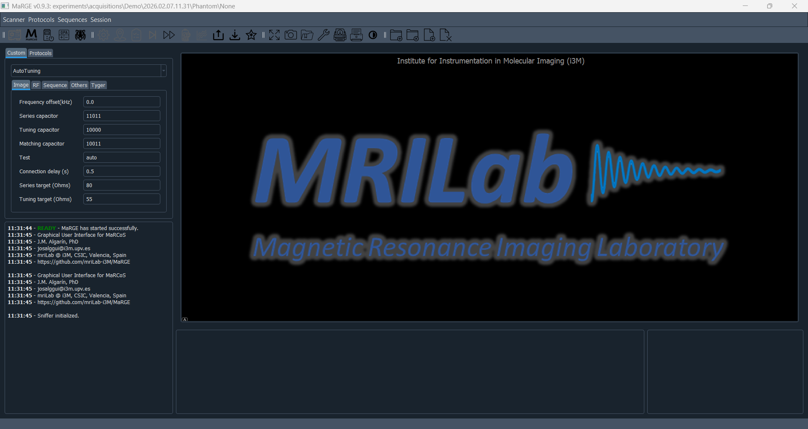

[](https://github.com/vnegnev/marcos_client)
[](https://github.com/vnegnev/marcos_server)
[](https://github.com/vnegnev/marcos_extras)

# MaRGE (MaRCoS Graphical Environment)

🚀 **Version 1.0.0 coming soon — stay tuned!**

**MaRGE** is a Python-based graphical environment for interacting with the **MaRCoS MRI research system**. It provides a user-friendly GUI for running MRI sequences, configuring parameters, and managing experiments without needing to work directly with low-level control code.

MaRGE is designed for MRI researchers, developers, and students working with the MaRCoS platform.

---

## Preview



## Features

🧲 Graphical interface for MaRCoS MRI experiments

⚙️ Sequence configuration and execution

🧪 Research-oriented workflow

🧩 Extensible sequence architecture

🐍 Fully Python-based

## Installation with pip
Install MaRGE with pip if you only need to run the GUI and do not plan to modify the source code or add custom sequences.

```bash
pip install marge-mri
```

Launch the GUI with:

```python
# Import marge
from marge import main

# Run MaRGE
main.MaRGE()
```

## Installation from source (Developer mode)

Use this method if you want to modify the codebase or include your own sequences.

```bash
git clone https://github.com/josalggui/MaRGE.git
```
Create and activate a virtual environment (recommended):
```bash
python -m venv venv
source venv/bin/activate   # Linux/macOS
venv\Scripts\activate      # Windows
```
Install requirements
```bash
pip install -r requirements.txt
```

## Full Installation (MaRGE + MaRCoS Setup)

For a complete installation including MaRCoS configuration, hardware setup, and developer options, please follow the detailed step-by-step guide in the Wiki:

👉 [Full Installation Guide](https://github.com/josalggui/MaRGE/wiki/Setting-up-MaRGE-and-MaRCoS-from-scratch)

## Requirements

* Python 3.10 or newer

* A working MaRCoS system installation with static IP address

* Supported OS: (update — Linux / Windows / macOS as applicable)

## Documentation

📖 Wiki: https://github.com/josalggui/MaRGE/wiki
 (under development)

📚 Documentation site: https://josalggui.github.io/MaRGE/
 (under development)

📦 PyPI package: https://pypi.org/project/marge-mri/