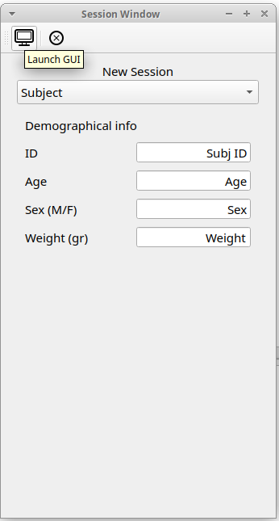
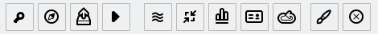
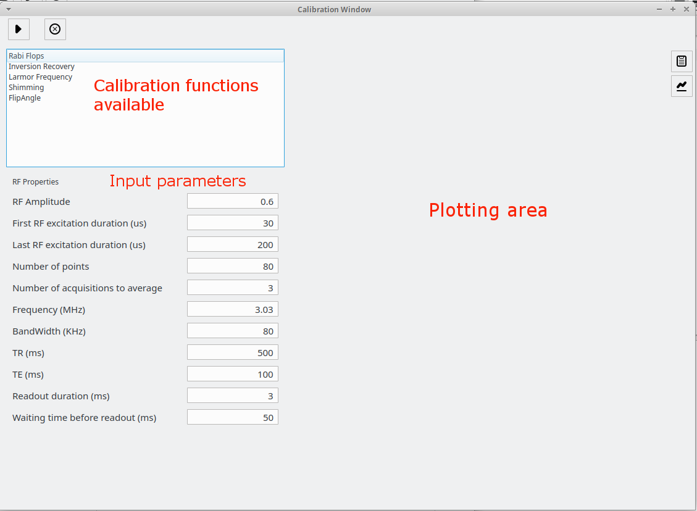
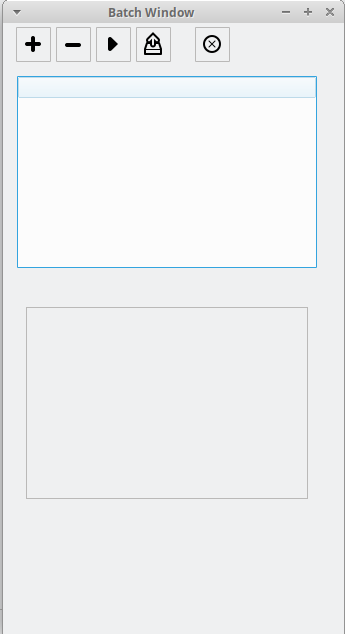
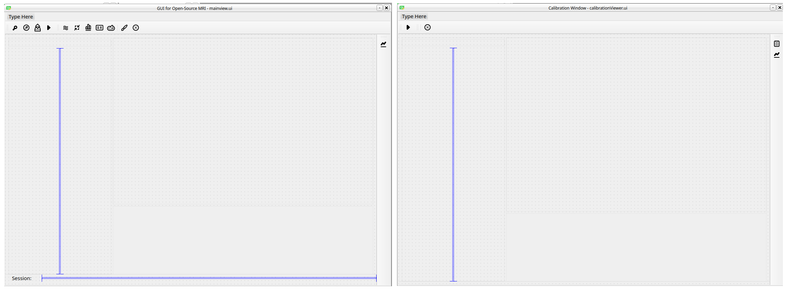
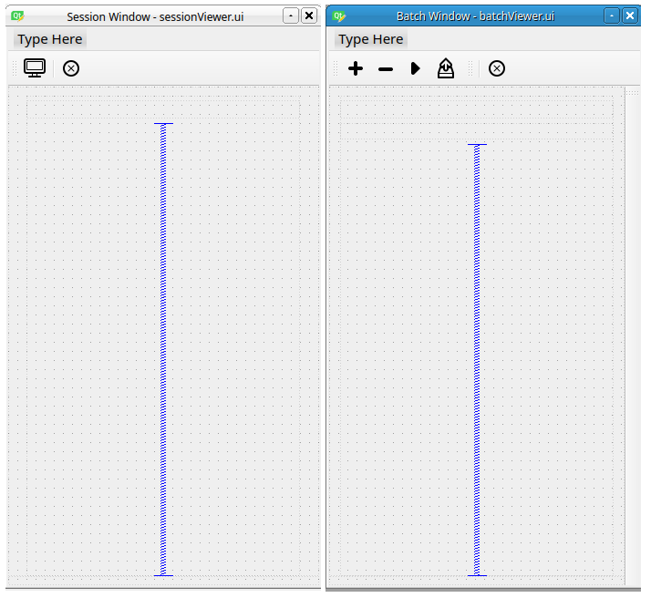
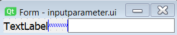

# PhysioMRI_GUI

Python code associated to the Graphical User Interface of PhysioMRI scanner from MRILab.

## Technical requirements to use PhysioMRI GUI 

1. Install python3.

2. Install pyQt5 and other python packages like datetime, nibabel, numpy,  .

3. Clone the following repositories from *https://github.com/vnegnev* at the same level of directories than PhysioMRI_GUI:

- marcos_client
- marcos_server
- marcos_extras

Edit the values of the variables in `local_config.py` inside marcos_client according to your IP address, Red Pitaya model and kind of gradient board available.

Execute the GUI by running ***FirstMRI.py***.

## How to use the GUI

### Start the connection with the Red Pitaya

In a linux terminal, start the connection between the Red Pitaya and execute marcos_server:

```
../marcos_extras/copy_bitstream.sh "ip_of_your_red_pitaya" rp-122
ssh root@"ip_of_your_red_pitaya" "~/marcos_server"
```

### Launch FirstMRI.py

The first window to appear is the sessionWindow (Figure 1), where you can first select the object that is going to be imaged and introduce parameters like the ID, demographic variables, etc.



**Figure 1.- Session Window**

Then, we launch the GUI main window by clicking to the corresponding icon. We distinguish 5 different areas in the GUI main window: 1) Main menu icons, 2) Sequence selection, 3) Parameters area, 4) Plotting area and 5) Console area. Figure 2.


**Figure 2.- Main Window**

### GUI main menu



1) Initialization of the GPA: makes the initilization of the GPA gradients card.
2) Calibration of the system: launches a window with all the calibration functions.
3) Activate upload to XNAT: if this button is enabled, the GUI uploads the MRI to the XNAT system if XNAT is installed.
4) Start acquisition: start the acquisition with the selected sequence and the parameters introduced.
5) Load parameters of a sequence from a file: load sequence and associated parameters previously saved in a file to the GUI. 
6) Save the parameters of a sequence to a file: it saves the name of the sequence and the parameters introduced in the GUI into a file. It is useful to reuse configurations or to acquire multiple images with different configurations sequentially.
7) View the defined sequence: plot the sequence (RF pulses and X, Y and Z gradients).
8) Change session: it closes the `GUI main window` and it opens the `Session Window` again. 
9) Batch acquisition: it allows acquiring multiple images with multiple sequences sequentially, without human intervention.
10) Change Window appearance
11) Close window

#### Calibration of the system



**Figure 3.- Calibration window**

#### Batch acquisition

It allows acquiring multiple images with different sequences sequentially, without human intervention (Figure 4). With the `plus` button you can add files with sequence parameters previously saved in the GUI main window. You can remove them with the `minus` button.



**Figure 4.- Batch acquisition window** 

## Structure of the folders and files in the GUI     

PhysioMRI_GUI folder contains many folders and files. You find here a description of their content.

### `ui` folder
		
It contains the files created with Designer Qt5, which are a basic structure of the different windows. There are different kinds of ui files in the GUI. On the one hand, we have the general structure of the four windows: session window, main window, calibration window and batch window.
Main and calibration uis are very similar with each other (Figure 5), and session and batch uis are also similar with each other (Figure 6).



**Figure 5.- Main and calibration uis**



**Figure 6.- Session and batch uis**

On the other hand, there are ui files that represent single elements that will be introduced programally to the general structure of the windows (to one of the four previous windows).
These elements are:

- inputparameter.ui (Figure 7a)	
- inputshimming.ui (Figure 7b)
- gradients.ui (Figure 7c)



**Figure 7.- Input parameter ui**

### `controller` folder

In this folder you will find all the python functions that control:

1. The 4 GUI windows (*sessioncontroller.py, mainviewcontroller.py, calibrationcontroller.py, batchcontroller.py*). These files give functionality to the different icons in the menus, 
2. The interactive addition of input elements in these windows, i.e. according to the sequence selected in the sequence selector, many inputparameter.ui will be added to the mainwindow.ui.
These controllers are: *sequencecontroller.py* for the main window, *calibfunctionscontroller.py* for the calibration window and *sessionviewer_controller.py* for the session window. The batch window does not load input parameters automatically.
3. The execution of a sequence in the scanner (*acquisitioncontroller.py*) and the execution of the calibration functions (*calibrationAcqcontroller.py*)

### `seq` folder

Folder that contains the different sequences that can be applied in the scanner.

### `seq_standalone` folder

Folder that contains sequences that can be executed in the scanner independently of the GUI and are firstly stored here to be tested.

### `manager` folder

- *datamanager.py*: class for managing the data processing of acquired data. 

### `configs` folder

- *hw_config_2.py*: a file with variables used in all the sequences. These variables depend on the scanner hardware (i.e. gradients) or other general values.
- *globalFunctions.py*: script with multiple functions that can be used globally.

### `experiments` folder

The results of the experiments are stored in this file. There are two folders inside:

- *acquisitions*: the scanner acquisitions are stored here. A folder per day is created, with the date as name (YYYY.MM.DD). Inside each of these folders, new folders with the date and time timestamps are created (YYYY.MM.DD.HH.mm.ss). The output of the scanner is stored inside, which is a .mat and a .nii files.   
- *parameterisations*:folder where the sequences parameters (in txt files) are stored when you click to *Save the parameters of a sequence to a file* icon in the GUI main window.

### `resources` folder

In this folder, the icons used in the main menu (and others) are stored.

### `images` folder

The images used in this readme are stored here.

### `view` folder

Some stylesheets are stored in this folder, which allow changing the appearance of the GUI with the button in the GUI main menu. These two styles are in use at the moment:
       
- breeze-light.qss
- breeze-dark.qss

### Other files 

- **Namespace functions**: these files contain the correspondance between the variables names in the GUI and the text associated to these variables that will appear in the GUI. These functions are *calibfunctionsnamespace.py* and *sequencesnamespace.py*.
- **Modes functions**: these files contain the default sequences or calibration functions that are displayed in the GUI when it is executed. These functions are *sequencemodes.py*, *sessionmodes.py* and *calibfunctionsmodes.py*.
- **Console function**: *stream.py* is a class used to write error messages in the console of the GUI.  

## How to add a new sequence to the GUI


## How to add new calibration functions to the GUI
